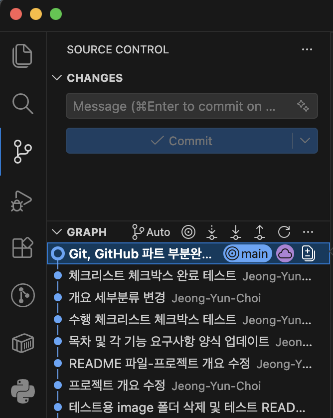

# 프로젝트 개요
해당 프로젝트는 코디세이 2기 입학연수과정에서 진행되는 첫 번째 미션인 <내 컴퓨터에 개발자용 '작업실' 꾸미기>에 대한 것으로 본격적인 개발에 앞서 개발 환경을 구축하고 준비하는 과정을 담고 있습니다. 다음과 같이 크게 세 가지 도구에 대해서 다루게 됩니다.
 - 리눅스 CLI(Command Line Interface) : 터미널(Terminal)
 - 도커(Docker) : 컨테이너(Container)
 - 깃/깃헙(Git/GitHub) : 버전 관리 및 협업툴
 
 본 과제의 목표는 다음과 같습니다.
 1. 절대 경로 vs 상대 경로
 2. 파일 권한의 의미, 권한 표기법의 규칙
 3. 기존 Dockerfile 기반 커스텀 이미지 생성
 4. 포트 매핑이 필요한 이유
 5. Docker 볼륨(데이터 영속성)
 6. Git(로컬 버전관리) vs GitHub(원격 협업 플랫폼)의 역할

 # 목차

[1) 실행환경](#1-실행환경)

[2) 수행 항목 체크리스트](#2-수행-항목-체크리스트)

[3) 터미널 조작 및 권한 실습](#3-터미널-조작-및-권한-실습)

&nbsp;&nbsp;&nbsp;&nbsp; [3-1) 터미널 조작](#3-1-터미널-조작)

&nbsp;&nbsp;&nbsp;&nbsp; [3-2) 권한 실습](#3-2-권한-실습)

[4) Docker 실습](#4-docker-실습)

&nbsp;&nbsp;&nbsp;&nbsp;[4-1) Docker 설치 및 기본 점검](#4-1-docker-설치-및-기본-점검)

&nbsp;&nbsp;&nbsp;&nbsp;[4-2) Docker 기본 운영 명령 수행](#4-2-docker-기본-운영-명령-수행)

&nbsp;&nbsp;&nbsp;&nbsp;[4-3) 컨테이너 실행 실습](#4-3-컨테이너-실행-실습)

&nbsp;&nbsp;&nbsp;&nbsp;[4-4) 기존 Dockerfile 기반 커스텀 이미지 제작](#4-4-기존-dockerfile-기반-커스텀-이미지-제작)

&nbsp;&nbsp;&nbsp;&nbsp;[4-5) 포트 매핑 및 접속](#4-5-포트-매핑-및-접속)

&nbsp;&nbsp;&nbsp;&nbsp;[4-6) Docker 볼륨 영속성 검증](#4-6-docker-볼륨-영속성-검증)

[5) Git 설정 및 GitHub 연동](#5-git-설정-및-github-연동)

[6) 트러블슈팅](#6-트러블슈팅)

[7) 검증방법](#7-검증방법)

## 1) [실행환경](#실행환경-검증)
- **OS :  macOS 15.7.7**

- **SHELL : bash 5.9 x86_64**

- **Terminal : Apple_Terminal 455.1**

- **Docker : 28.5.2 build ecc6942**

- **Git : 2.53.0**
```bash
jeongyun.choi*** ~ % sw_vers # OS 이름 및 버전 확인
ProductName:		macOS
ProductVersion:		15.7.7
BuildVersion:		24G720

jeongyun.choi** ~ % echo $SHELL # 쉘의 종류 이름
/bin/bash
jeongyun.choi** ~ % bash --version # 쉘의 버전
bash 5.9 (x86_64-apple-darwin24.0)

jeongyun.choi*** ~ % echo $TERM_PROGRAM # 터미널명 확인
Apple_Terminal
jeongyun.choi***~ % echo $TERM_PROGRAM_VERSION # 터미널 버전 확인
455.1

jeongyun.choi** ~ % docker --version # Docker 버전 확인
Docker version 28.5.2, build ecc6942

jeongyun.choi*** projects % git --version # Git의 버전 확인
git version 2.53.0
```

## 2) 수행 항목 체크리스트
- [X] 터미널 기본 조작 및 폴더 구성

- [X] 권한 변경 실습

- [ ] Docker 설치 및 기본 점검

- [ ] hello-world 실행

- [ ] Dockerfile 빌드/실행

- [ ] 포트 매핑 접속

- [ ] 바인드 마운트 반영

- [ ] 볼륨 영속성 검증

- [X] Git 초기 설정

- [X] VSCode GitHub 연동

## 3) 터미널 조작 및 권한 실습
### 3-1) 터미널 조작

터미널 조작에 익숙해져야 하는 이유는 Docker의 컨테이너나 Git이 전부 터미널의 CLI로 수행되기 때문이다.

&#8251; 이동하고자 하는 디렉토리가 현재 위치에 있지 않은 경우, 현재 위치에서 해당 디렉토리까지의 전체 경로가 표현되어야만 이동할 수 있다.

&#8251; 파일과 디렉토리의 이름을 변경하는 명령어는 mv로 동일하다. 경로를 변경하지 않으면 이름을 변경하는 명령어로 작동한다. 또한 이름변경과 동시에 이동시킬 수도 있다.

```bash
# 현재 위치와 파일 목록 확인
jeongyun.choi** Pre-Codyssey-Setup % pwd # 현재 위치를 확인하는 명령어(현재 위치를 절대경로로 출력해줌)
/Users/jeongyun.choi**/Pre-Codyssey-Setup
jeongyun.choi** Pre-Codyssey-Setup % ls -l # -a 옵션을 사용하지 않으면 숨김 파일은 뜨지 않음
total 32
drwxr-xr-x  3 jeongyun.choi**  jeongyun.choi**     96  8 12 09:54 docs
-rw-r--r--  1 jeongyun.choi**  jeongyun.choi**  15736  8 12 09:54 README.md

jeongyun.choi** Pre-Codyssey-Setup % ls -la # 숨김 파일을 포함한 목록을 확인하는 명령어
total 32
drwxr-xr-x   5 jeongyun.choi**  jeongyun.choi**    160  8 12 09:54 .
drwxr-x---+ 19 jeongyun.choi**  jeongyun.choi**    608  8 12 09:56 ..
drwxr-xr-x  12 jeongyun.choi**  jeongyun.choi**    384  8 12 09:58 .git
drwxr-xr-x   3 jeongyun.choi**  jeongyun.choi**     96  8 12 09:54 docs
-rw-r--r--   1 jeongyun.choi**  jeongyun.choi**  15736  8 12 09:54 README.md


# 디렉토리로 이동 - 상대경로 표현
jeongyun.choi** Pre-Codyssey-Setup % cd .. # 현재 위치에서 부모 디렉토리로 이동(현재 위치: Pre-Codyssey-Setup)
jeongyun.choi** ~ %
jeongyun.choi** ~ % cd Pre-Codyssey-Setup # 현재 위치에서 특정한 디렉토리로 이동(현재 위치: 홈(~) 디렉토리) 
jeongyun.choi** Pre-Codyssey-Setup %
jeongyun.choi** ~ % cd Pre-Codyssey-Setup/docs # 현재 위치에서 하위 디렉토리로 한번에 이동                          
jeongyun.choi** docs %

# 파일의 이동
jeongyun.choi** Desktop % find "$(pwd)" -maxdepth 1 -type f  # 파일이 위치한 절대경로 확인(현재 파일의 위치: Desktop)          
/Users/jeongyun.choi**/Desktop/move-file.txt
jeongyun.choi** Desktop % mv move-file.txt /Users/jeongyun.choi**/Documents # 파일을 이동시킬 디렉토리로 이동시킴-절대경로
jeongyun.choi** Desktop % cd /Users/jeongyun.choi**/Documents 
jeongyun.choi** Documents % find "$(pwd)" -maxdepth 1 -type f # 이동시킨 뒤 바뀐 위치 절대경로 확인(현재 파일의 위치: Documents)
/Users/jeongyun.choi**/Documents/move-file.txt

# 디렉토리의 이동
jeongyun.choi** move-dir % pwd
/Users/jeongyun.choi**/move-dir
jeongyun.choi** ~ % mv move-dir Desktop # 현재 위치에서 디렉토리를 Desktop 디렉토리로 이동시킴-상대경로
jeongyun.choi** ~ % cd Desktop/move-dir 
jeongyun.choi** move-dir % pwd # 이동되었는지 확인
/Users/jeongyun.choi**/Desktop/move-dir

# 파일과 디렉토리의 이름 변경
jeongyun.choi** Documents % ls 
move-file.txt
jeongyun.choi** Documents % mv move-file.txt change-filename.txt  # 파일의 이름 변경
jeongyun.choi** Documents % ls # 변경되었는지 확인
change-filename.txt

jeongyun.choi** ~ % ls # 이름이 변경되기 전의 디렉토리명: move-dir
Desktop			Library			Music			Pre-Codyssey-Setup
Documents		move-dir		OrbStack		Public
Downloads		Movies			Pictures
jeongyun.choi** ~ % mv move-dir change-dirname # 디렉토리의 이름 변경
jeongyun.choi** ~ % cd change-dirname # 변경되었는지 확인
jeongyun.choi** change-dirname %


# 파일과 디렉토리 생성 및 파일의 내용 확인
jeongyun.choi** ~ % mkdir make-dir # 디렉토리 생성
jeongyun.choi** ~ % ls -lt # 생성되었는지 확인
total 16
drwxr-xr-x   2 jeongyun.choi**  jeongyun.choi**    64  8 12 16:46 make-dir

jeongyun.choi** ~ % echo "파일을 생성합니다" > make-file-echo.txt # 내용 있는 txt 파일 생성
jeongyun.choi** ~ % cat make-file-echo.txt # 파일 내용 확인
파일을 생성합니다

jeongyun.choi** ~ % touch make-empty-file.md # 빈 파일 생성
jeongyun.choi** ~ % ls -lt # 생성되었는지 확인
total 8
-rw-r--r--   1 jeongyun.choi**  jeongyun.choi**     0  8 12 16:36 make-empty-file.md


# 파일과 디렉토리의 복사
jeongyun.choi** Documents % ls # 현재 파일의 원본 위치: Documents
change-filename.txt
jeongyun.choi** Documents % cp change-filename.txt /Users/jeongyun.choi**/Downloads # 파일을 복사할 디렉토리로 복사-절대경로
jeongyun.choi** Documents % cd /Users/jeongyun.choi**/Downloads # 복사되었는지 확인
jeongyun.choi** Downloads % ls 
change-filename.txt
jeongyun.choi** ~ % cd Documents # 복사 한 뒤에도 원본 파일 위치에 있는지 확인
jeongyun.choi** Documents % ls
change-filename.txt


# 파일과 디렉토리의 삭제
jeongyun.choi** ~ % ls # 삭제할 파일 목록 확인
change-dirname		Downloads		Music			Pre-Codyssey-Setup
Desktop			Library			OrbStack		Public
Documents		Movies			Pictures		remove-file.txt
jeongyun.choi** ~ % rm remove-file.txt # remove-file.txt 파일 삭제
jeongyun.choi** ~ % ls # 삭제됐는지 확인
change-dirname		Downloads		Music			Pre-Codyssey-Setup
Desktop			Library			OrbStack		Public
Documents		Movies			Pictures

jeongyun.choi** ~ % ls # 삭제할 디렉토리 목록 확인
Desktop			Library			OrbStack		Public
Documents		Movies			Pictures		remove-dir
Downloads		Music			Pre-Codyssey-Setup
jeongyun.choi** ~ % rm -r remove-dir # remove-dir 디렉토리 삭제
jeongyun.choi** ~ % ls # 삭제됐는지 확인
Desktop			Library			OrbStack		Public
Documents		Movies			Pictures
Downloads		Music			Pre-Codyssey-Setup
```

<br>
<br>

### 3-2) 권한 실습

[파일 권한 규칙 해석]

r(4) : read, 읽기 권한 / w(2) : write, 쓰기 권한 / x(1) : execute, 실행 권한

&#8251; 디렉토리에서의 실행 권한은 파일을 실행시키는 것과는 조금 다른 의미를 가진다. 디렉토리에서의 실행 권한은 디렉토리에 내부에 접근하거나 탐색할 수 있는 권한을 의미하기 때문이다.

```bash
# 파일의 권한 변경
jeongyun.choi** ~ % ls -ld permission.txt # 변경 전 644
-rw-r--r--  1 jeongyun.choi**  jeongyun.choi**  0  8 14 20:17 permission.txt

jeongyun.choi** ~ % chmod 600 permission.txt # 변경 후(그룹사용자와 기타 사용자의 읽기 권한을 제거)
jeongyun.choi** ~ % ls -ld permission.txt # 변경되었는지 확인
-rw-------  1 jeongyun.choi**  jeongyun.choi**  0  8 14 20:17 permission.txt

# 디렉토리의 권한 변경
jeongyun.choi** ~ % ls -ld permission # 변경 전 755
drwxr-xr-x  2 jeongyun.choi**  jeongyun.choi**  64  8 14 20:37 permission
jeongyun.choi** ~ % chmod 700 permission # 변경 후(그룹사용자와 기타사용자의 읽기와 실행 권한을 제거)
jeongyun.choi** ~ % ls -ld permission # 변경되었는지 확인
drwx------  2 jeongyun.choi**  jeongyun.choi**  64  8 14 20:37 permission
```
<br>
<br>

## 4) Docker 실습
### 4-1) Docker 설치 및 기본 점검

&#8251; `Server:` 뒤에 다음과 같이 출력결과가 나온다면 데몬이 정상적으로 동작하고 있음을 알 수 있다.
```bash
jeongyun.choi** ~ % docker --version # Docker 설치 확인 및 버전 확인
Docker version 28.5.2, build ecc6942


jeongyun.choi** ~ % docker info # docker 데몬 동작 여부 확인
Client:
 Version:    28.5.2
 Context:    orbstack
(...후략...)

Server:
 Containers: 0
  Running: 0
  Paused: 0
  Stopped: 0
 Images: 0
 Server Version: 28.5.2
 Storage Driver: overlay2
(...생략...)
 Runtimes: io.containerd.runc.v2 runc
(...생략...)
 Operating System: OrbStack
 OSType: linux
 Architecture: x86_64
 CPUs: 6
 Total Memory: 15.67GiB
(...생략...)
 Default Address Pools:
   Base: 192.168.97.0/24, Size: 24
  (...생략...)
   Base: fd07:b51a:cc66:d000::/56, Size: 64

WARNING: DOCKER_INSECURE_NO_IPTABLES_RAW is set


jeongyun.choi** ~ % docker ps # 간단하게 데몬 동작 여부를 확인
CONTAINER ID   IMAGE     COMMAND   CREATED   STATUS    PORTS     NAMES
```
반면, 정상작동하지 않고 있을 때는 다음과 같은 문구가 뜬다.
```bash
jeongyun.choi*** ~ % docker ps # 정상적으로 동작하고 있지 않을 때
Cannot connect to the Docker daemon at unix:///Users/jeongyun.choi**/.orbstack/run/docker.sock. Is the docker daemon running?
```
### 4-2) Docker 기본 운영 명령 수행
**- 다운로드된 이미지를 확인하는 명령어**

```bash
docker images
```
**&#9654; 수행 로그**
```bash
jeongyun.choi** ~ % docker images
REPOSITORY   TAG       IMAGE ID   CREATED   SIZE
```
현재는 docker를 처음 실행한 상태이기 때문에 이미지 목록에는 아무것도 뜨지 않는다.

### 4-3) 컨테이너 실행 실습
### 4-4) 기존 Dockerfile 기반 커스텀 이미지 제작
### 4-5) 포트 매핑 및 접속
### 4-6) Docker 볼륨 영속성 검증
## 5) Git 설정 및 GitHub 연동
### 5-1) GitHub 계정 연동하기
**- 계정 연동 시 사용되는 명령어**
```bash
git config --global user.email "이메일주소"
git config --global user.name "사용자이름(username)"
```
**&#9654; 수행 로그**
```bash
jeongyun.choi** ~ % git config --global user.name "Jeong-Yun-Choi" # GitHub 가입 시 사용한 사용자이름(username)
jeongyun.choi** ~ % git config --global user.email "*****@*****" # GitHub 가입 시 사용한 이메일 주소
```
### 5-2) 기본 브랜치 설정하기
**- 기본 브랜치 설정 시 사용되는 명령어**
```bash
git config --global init.defaultBranch main
```
**&#9654; 수행 로그**
```bash
jeongyun.choi*** projects-setup % git config --global init.defaultBranch main
main
```
### 5-3) 로컬저장소에 Git 초기화하기
```bash
jeongyun.choi****~ % pwd # 현재 위치 확인
/Users/jeongyun.choi**

jeongyun.choi ~ % cd projects-setup # 로컬저장소로 사용할 디렉토리로 이동
jeongyun.choi**** projects-setup % 
```
**- Git 초기화시 사용되는 명령어**
```bash
git init
```
**&#9654; 수행 로그**
```bash
jeongyun.choi**** projects-setup % git init
/Users/jeongyun.choi**/projects-setup/.git/ 안의 빈 깃 저장소를 다시 초기화했습니다
```
### 5-4) 로컬저장소와 원격저장소 연결하기
**- 두 저장소를 연결하는 명령어**

```bash
git remote add origin 해당 레포지토리 주소(원격저장소 주소)
```
**&#9654; 수행 로그**

```bash
jeongyun.choi**** projects-setup % git remote -v
origin	https://github.com/Jeong-Yun-Choi/Pre-Codyssey-Setup.git (fetch)
origin	https://github.com/Jeong-Yun-Choi/Pre-Codyssey-Setup.git (push)
```
### 5-5) 원격저장소와 로컬저장소의 연동 확인하기
**- 두 저장소의 연동 확인하는 명령어**


```bash
jeongyun.choi**** projects-setup % git config --list
credential.helper=osxkeychain
user.email=*****@****
user.name=Jeong-Yun-Choi
init.defaultbranch=main
core.repositoryformatversion=0
core.filemode=true
core.bare=false
core.logallrefupdates=true
core.ignorecase=true
core.precomposeunicode=true
remote.origin.url=https://github.com/Jeong-Yun-Choi/Pre-Codyssey-Setup.git
remote.origin.fetch=+refs/heads/*:refs/remotes/origin/*
```
### 5-6) VSCode와 GitHub 계정 연동 확인하기


## 6) 트러블슈팅

## 7) 검증방법
